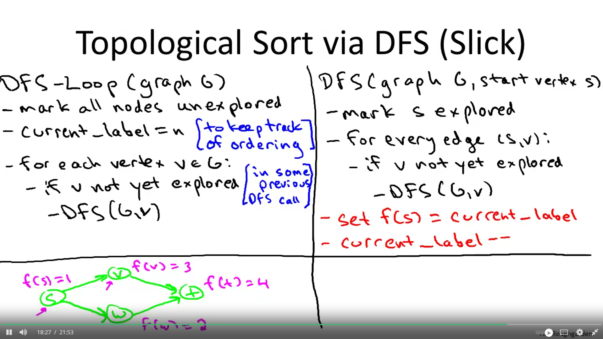
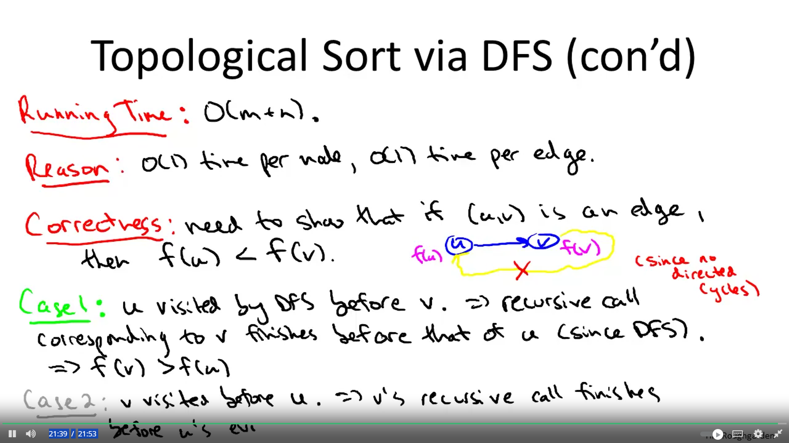

# Topological Sort via DFS (Slick)

### Coursera



### DFS-Loop (graph G)

1. Mark all nodes unexplored
2. `current_label = n` (to keep track of ordering)
3. For each vertex `v` in `G`:
    - If `v` is not yet explored (in some previous DFS call):
        - `DFS(G, v)`

### DFS(graph G, start vertex s)

1. Mark `s` explored
2. For every edge `(s, v)`:
    - If `v` is not yet explored:
        - `DFS(G, v)`
3. Set `f(s) = current_label`
4. `current_label--`

### Explanation:

- **DFS-Loop**: Initializes all nodes as unexplored and starts the topological sort process by iterating over each vertex in the graph.
- **DFS**: Recursively explores each vertex and its neighbors, marking them as explored. Once all neighbors are processed, it sets the topological order label and decrements the label for the next vertex.

### C++ Code Implementation

```cpp
#include <iostream>
#include <vector>
#include <unordered_map>
#include <stack>
#include <algorithm>

using namespace std;

// Helper function to perform DFS and topological sorting
void dfs(const string& v, unordered_map<string, bool>& visited, stack<string>& Stack, const unordered_map<string, vector<string>>& graph) {
    visited[v] = true;
    
    // Process all the vertices adjacent to this vertex
    for (const auto& neighbor : graph.at(v)) {
        if (!visited[neighbor]) {
            dfs(neighbor, visited, Stack, graph);
        }
    }
    
    // Push the current vertex to the stack which stores the result
    Stack.push(v);
}

// Function to perform topological sort
vector<string> topologicalSort(const unordered_map<string, vector<string>>& graph) {
    stack<string> Stack;
    unordered_map<string, bool> visited;
    
    // Initialize all vertices as not visited
    for (const auto& pair : graph) {
        visited[pair.first] = false;
    }
    
    // Call the recursive helper function to store Topological Sort
    // starting from all vertices one by one
    for (const auto& pair : graph) {
        if (!visited[pair.first]) {
            dfs(pair.first, visited, Stack, graph);
        }
    }
    
    // Collecting the topological sort order from stack
    vector<string> result;
    while (!Stack.empty()) {
        result.push_back(Stack.top());
        Stack.pop();
    }
    
    return result;
}

int main() {
    // Example graph represented as an adjacency list
    unordered_map<string, vector<string>> graph = {
        {"A", {"C"}},
        {"B", {"C", "D"}},
        {"C", {"E"}},
        {"D", {"F"}},
        {"E", {"F"}},
        {"F", {}}
    };
    
    vector<string> result = topologicalSort(graph);
    
    cout << "Topological Sort: ";
    for (const auto& vertex : result) {
        cout << vertex << " ";
    }
    cout << endl;
    
    return 0;
}
```

## Explanation of the Code
### Initialization:

- **unordered_map<string, bool> visited:** Keeps track of explored vertices.
- **stack\<string> Stack:** Stores the vertices in topological order.
### DFS Function:

- Marks the current vertex as visited.
- Recursively explores all its neighbors.
- Pushes the current vertex to the stack after all its neighbors are processed.
### Topological Sort:

- Iterates through all vertices and initiates DFS for unvisited vertices.
- Collects the vertices from the stack to get the topological order.

## Usage
- The graph is represented as an adjacency list using an unordered_map where the keys are vertex names and the values are vectors of adjacent vertices.
- The topologicalSort function processes the graph and returns a vector containing the vertices in topological order.
- The main function demonstrates the usage with an example graph and prints the topological sort order.